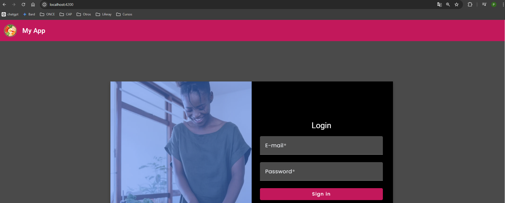

# Full Stack: Angular and Java Spring Boot Recipe-Sharing

This Full stack project is a simple CRUD for cooking recipes.

## Features

- **User Authentication**: Utilizes JWT (JSON Web Tokens) and Spring Security for authentication and authorization.
- **Recipe Management**: Perform CRUD (Create, Read, Update, Delete) operations on cooking recipes.

## Technologies 

- Angular: 17
- Angular Material
- Tailwindcss
- css
- Typescript
- Apache Maven
- Hibernate
- Spring Boot 3.1.11
- Spring Data
- Spring core
- Spring security
- Jwt

## Interfaces 

### Register

### Login

### Home

### New Recipe

### Edit Recipe

## Demo
[Link to video Demo](https://www.youtube.com/watch?v=gm6MtrvOHqY)
